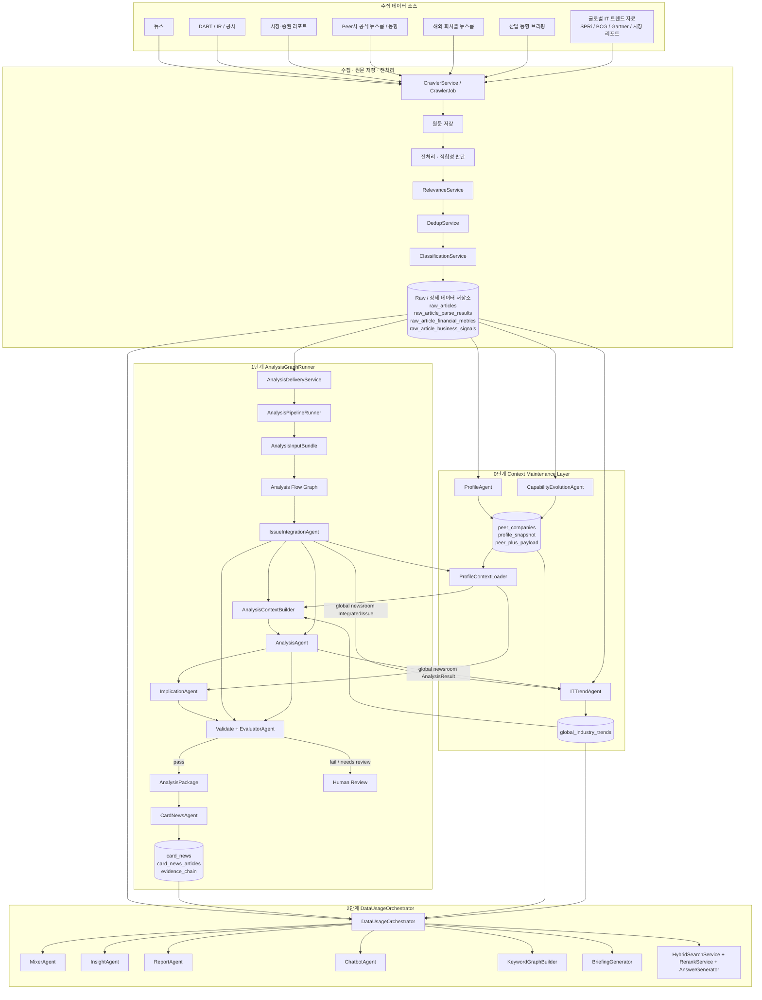

# AXIS Agent Architecture

작성일: 2026-05-26 KST  
상태: Draft v0.1  
목적: agent/service/job 이름과 책임을 안정화하기 전, 전체 폴더 구조와 대표 설계 문서를 고정한다.

## 폴더 구조

```text
design/00-agent-architecture/
  README.md                         # 전체 단계와 canonical architecture
  naming-map.md                     # Agent / Service / Builder / Job 이름 규칙과 변경표
  planned-file-structure.md         # 추후 개발 placeholder 코드 파일 위치
  component-contract-template.md    # 모든 컴포넌트 문서 작성 템플릿
  open-questions.md                 # 다음 회의/리뷰에서 결정할 질문

  00-context-maintenance/
    README.md                       # Context Maintenance Layer 개요
    profile-agent.md                # ProfileAgent
    capability-evolution-agent.md   # CapabilityEvolutionAgent
    it-trend-agent.md               # ITTrendAgent
    profile-context-loader.md       # ProfileContextLoader

  10-analysis-graph-runner/
    README.md                       # 1단계 분석 DAG 개요
    node-contracts.md               # Analysis Flow Graph node별 계약

  20-data-usage-orchestrator/
    README.md                       # 2단계 저장 데이터 활용 개요
    component-catalog.md            # Mixer/Insight/Report/Chatbot/Search/Keyword 계열 catalog
```

기존 `design/10-ingestion`, `design/20-enrichment`, `design/30-analysis`,
`design/40-user-query`, `design/60-briefing` 문서는 상세 설계 reference로 유지한다.
새 구조가 canonical index이고, 기존 문서는 점진적으로 이름과 책임을 맞춘다.

## 3단계 아키텍처

```text
0단계 Context Maintenance Layer
  피어사(SK AX 포함) 프로필 생성, capability 변화 추적, 글로벌/산업 IT trend context 생성

1단계 AnalysisGraphRunner
  수집/정제된 raw 데이터 -> 이슈 통합 -> 분석 -> 시사점 -> 검증 -> 카드뉴스 저장

2단계 DataUsageOrchestrator
  저장된 raw/card/profile/trend 결과 -> 비교, 리포트, 인사이트, 챗봇, 키워드/검색 활용
```

## 전체 흐름



## 책임 경계

### 수집/전처리 계층

- raw 데이터를 가져오고 저장한다.
- 관련성, 중복, 기업/섹터/이벤트 라벨을 붙인다.
- 분석, 시사점, SK AX 대응 방향을 만들지 않는다.

### Context Maintenance Layer

- 주기적으로 회사/산업 context를 갱신한다.
- runtime 분석 단계가 매번 긴 과거 데이터를 다시 읽지 않도록 압축된 context를 만든다.
- `ProfileContextLoader`는 LLM agent가 아니라 runtime context loader다.

### AnalysisGraphRunner

- `AnalysisInputBundle` 1건을 받아 카드뉴스 저장까지 실행한다.
- 현재는 fixed LangGraph DAG이며, 동적 router형 supervisor는 아니다.
- 각 node output은 `AnalysisFlowState.stage_outputs`에 남겨 이후 summary/insight/response node가 재사용한다.

### DataUsageOrchestrator

- 새 raw 데이터를 분석하지 않는다.
- 이미 저장된 raw/card/profile/trend 결과를 검색, 비교, 리포트, 인사이트, 챗봇, 키워드 그래프로 재활용한다.

## 다음 결정 지점

- `global_industry_trends`를 신규 테이블로 둘지, 기존 JSONB/legacy storage에 둘지.
- `ProfileAgent` 저장 컬럼명을 현재 코드와 맞춰 유지할지, `profile_snapshot` 계열로 마이그레이션할지.
- `EvaluatorAgent`를 validate node 내부 hard/soft gate로 계속 둘지, LLM Judge를 별도 Job으로 분리할지.
- `InsightAgent`를 1단계 분석 graph에 넣을지, 2단계 usage 전용으로 둘지.
