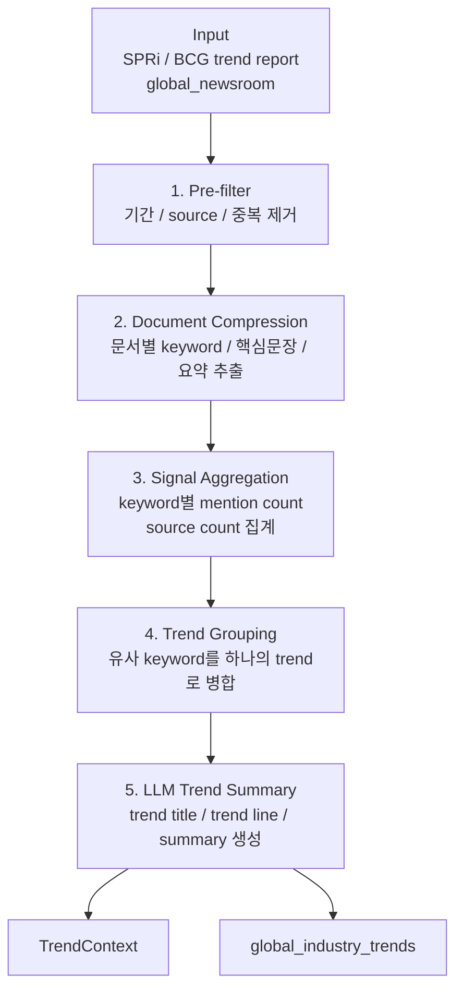

# ITTrendAgent — Design Plan

## 1. 메타

| 항목 | 값 |
|---|---|
| 이름 | `ITTrendAgent` |
| 위치 | `src/agents/it_trend_agent.py` |
| 목적 | 글로벌 IT 트렌드와 산업 흐름을 `TrendContext` 및 `global_industry_trends` 로 정리 |
| 주요 입력 | SPRi / BCG trend report, global_newsroom |
| 주요 출력 | `TrendContext`, `global_industry_trends` |

## 2. 한 줄 책임

> `ITTrendAgent` 는 SPRi/BCG 자료와 글로벌 뉴스룸 데이터를 기반으로 반복적으로 등장하는
> IT 트렌드 신호를 탐지하고, LLM 으로 trend summary 를 생성해 `TrendContext` 와
> `global_industry_trends` 로 저장한다.

## 3. 책임

- SPRi / BCG trend report 조회 및 정규화
- global_newsroom 데이터 조회 및 정규화
- 반복적으로 등장하는 IT trend keyword 탐지
- keyword 별 mention count, source count, intensity 계산
- 유사 keyword / topic 을 trend 단위로 병합
- LLM 을 사용해 trend title, trend line, summary 생성
- `TrendContext` 생성
- `global_industry_trends` 저장

## 4. 책임 NOT

- 원문 크롤링
- PDF / HTML 파싱
- 기업별 전략 해석
- 실행 권고안 생성
- DB schema 생성

## 5. Input

`ITTrendAgent` 의 primary input 은 두 종류다.

| 구분 | 데이터 | 역할 |
|---|---|---|
| Primary input | SPRi / BCG trend report | 산업·시장 관점의 IT 트렌드 보강 |
| Primary input | global_newsroom | 글로벌 기업의 기술·사업 발표 흐름 탐지 |

실행 시에는 분석 범위를 제어하는 runtime option 이 함께 전달될 수 있다.

| 옵션 | 설명 |
|---|---|
| `window_days` | 최근 N일 기준으로 분석 |
| `focus_themes` | 특정 theme 만 분석할 때 사용 |
| `min_mention_count` | trend 후보로 인정할 최소 등장 횟수 |
| `max_trend_count` | 최종 trend 후보 개수 제한 |

입력 예:

```json
{
  "window_days": 30,
  "focus_themes": ["agentic ai", "cloud"],
  "min_mention_count": 3,
  "max_trend_count": 8
}
```

## 6. Output

`ITTrendAgent` 의 output 은 크게 두 가지다.

| 출력 | 설명 |
|---|---|
| `TrendContext` | 이후 `StrategicAnalyzer` 가 참고할 글로벌 IT 트렌드 context |
| `global_industry_trends` | trend keyword 단위로 저장되는 read model |

### 6.1 Result Schema — `TrendContext`

`TrendContext` 는 분석 agent 가 바로 참고할 수 있도록 글로벌 IT 트렌드 흐름을 압축한
context 객체다. 여러 문서의 원문을 그대로 담지 않고, trend summary / trend line /
signal / source 중심으로 정리한다.

| 필드 | 타입 | 설명 |
|---|---|---|
| `period` | `string \| null` | 분석 기간. 예: `last_30d`, `2026-05` |
| `trend_summary` | `string` | 전체 트렌드를 1~2문장으로 요약한 문장 |
| `trend_lines` | `string[]` | 주요 trend 흐름을 문장 단위로 정리한 목록 |
| `signals` | `object[]` | trend keyword 별 구조화된 신호 목록 |
| `source_groups` | `string[]` | 사용된 source 묶음. 예: `SPRi`, `BCG`, `global_newsroom` |
| `sources` | `object[]` | 근거 문서의 최소 메타데이터 목록 |
| `updated_at` | `string` | context 생성 또는 갱신 시각 |
| `validation` | `object` | 결과 유효성 정보 |
| `metadata` | `object` | row count, trend count 등 부가 정보 |

`signals[]` 의 구조:

| 필드 | 타입 | 설명 |
|---|---|---|
| `signal` | `string` | trend keyword 또는 trend name |
| `intensity` | `string` | trend 강도. 예: `weak`, `moderate`, `strong` |
| `mention_count` | `number` | 분석 대상 문서에서 등장한 횟수 |
| `source_count` | `number` | 해당 trend 가 등장한 source 수 |
| `leading_sources` | `string[]` | 해당 trend 를 주로 언급한 source 목록 |
| `evidence_source_ids` | `string[]` | 근거 문서 id 목록 |

`TrendContext` 예:

```json
{
  "period": "last_30d",
  "trend_summary": "최근 글로벌 IT 흐름은 agentic AI, AI infrastructure, cloud 최적화로 요약된다.",
  "trend_lines": [
    "agentic AI 관련 발표가 글로벌 뉴스룸과 리서치 자료에서 반복적으로 등장한다.",
    "AI infrastructure 는 GPU, data center, inference 비용 최적화 흐름과 함께 확산된다."
  ],
  "signals": [
    {
      "signal": "agentic ai",
      "intensity": "strong",
      "mention_count": 18,
      "source_count": 3,
      "leading_sources": ["BCG", "Microsoft", "Google"],
      "evidence_source_ids": ["raw-101", "raw-228"]
    }
  ],
  "source_groups": ["SPRi", "BCG", "global_newsroom"],
  "sources": [],
  "updated_at": "2026-06-02T09:00:00+09:00",
  "validation": {
    "pass": true
  },
  "metadata": {
    "row_count": 42,
    "trend_count": 8
  }
}
```

### 6.2 Result Schema — `global_industry_trends`

`global_industry_trends` 는 1 trend keyword 를 1 row 로 저장한다.

| 컬럼 | 설명 |
|---|---|
| `trend_date` | 분석 일자 |
| `industry` | trend 가 속한 산업/기술 영역 |
| `region` | 기본값 `global` |
| `keyword` | trend keyword |
| `keyword_category` | keyword 분류 |
| `title` | trend 제목 |
| `summary` | trend 요약 |
| `mention_count` | 등장 횟수 |
| `confidence` | 결과 신뢰도 |
| `source_raw_article_ids` | 근거 raw article id |
| `payload` | trend line, source breakdown, prompt version 등 상세 JSON |

`payload` 의 기본 구조:

| 필드 | 타입 | 설명 |
|---|---|---|
| `trend_lines` | `string[]` | 해당 keyword 를 설명하는 trend line 목록 |
| `source_breakdown` | `object[]` | source 별 mention count / evidence 요약 |
| `evidence` | `object[]` | title, key sentence 등 최소 근거 |
| `intensity` | `string` | trend 강도 |
| `prompt_version` | `string` | LLM summary prompt 버전 |
| `batch_id` | `string` | 실행 batch id |

저장 row 예:

```json
{
  "trend_date": "2026-06-02",
  "industry": "ai",
  "region": "global",
  "keyword": "agentic ai",
  "keyword_category": "ai_tech",
  "title": "Agentic AI 확산",
  "summary": "글로벌 뉴스룸과 리서치 자료에서 agentic AI 기반 업무 자동화 흐름이 반복적으로 관측된다.",
  "mention_count": 18,
  "confidence": 0.82,
  "source_raw_article_ids": [101, 228],
  "payload": {
    "trend_lines": [
      "agentic AI는 enterprise workflow 자동화 흐름과 함께 반복적으로 언급된다."
    ],
    "source_breakdown": [
      {
        "source": "BCG",
        "mention_count": 4
      },
      {
        "source": "global_newsroom",
        "mention_count": 14
      }
    ],
    "evidence": [
      {
        "title": "AI agents reshape enterprise workflows",
        "key_sentences": ["..."]
      }
    ],
    "intensity": "strong",
    "prompt_version": "it-trend-v1",
    "batch_id": "it-trend-20260602-090000"
  }
}
```

## 7. 처리 흐름



## 8. 처리 단계 상세

### 8.1 Pre-filter

- 최근 `window_days` 기준으로 문서 조회
- SPRi / BCG / global_newsroom source 만 사용
- 중복 URL, 중복 title 제거
- 분석 가치가 낮은 문서 제외

### 8.2 Document Compression

긴 본문 전체를 한 번에 LLM 에 넣지 않는다. 문서별로 먼저 짧은 분석 단위로 압축한다.

문서별 압축 결과:

```json
{
  "title": "AI agents reshape enterprise workflows",
  "source": "BCG",
  "published_at": "2026-05-20",
  "keywords": ["agentic ai", "enterprise workflow"],
  "key_sentences": ["..."],
  "short_summary": "..."
}
```

### 8.3 Signal Aggregation

- 압축된 문서 결과만 모아서 집계
- keyword 별 등장 횟수 계산
- source 다양성 계산
- 최근성 계산
- 여러 source 에서 반복되는 신호를 trend 후보로 승격

### 8.4 Trend Grouping

비슷한 표현을 하나의 trend 로 병합한다.

예:

```text
AI agent
agentic AI
autonomous agent
enterprise agent
→ agentic ai
```

### 8.5 LLM Trend Summary

LLM 은 원문 전체가 아니라 집계된 trend 후보만 입력으로 받는다.

LLM 입력 예:

```json
{
  "trend": "agentic ai",
  "mention_count": 12,
  "source_count": 4,
  "sources": ["BCG", "Microsoft", "Google"],
  "evidence": [
    {
      "title": "AI agents reshape enterprise workflows",
      "key_sentences": ["...", "..."]
    }
  ]
}
```

LLM 의 역할:

- trend title 생성
- trend line 생성
- trend summary 생성
- 일시적 뉴스와 구조적 트렌드 구분

## 9. 왜 크롤링 전처리와 구분하는가

크롤링 전처리는 개별 문서를 분석 가능한 상태로 정제하는 단계이고,
`ITTrendAgent` 는 정제된 여러 문서를 묶어 반복적으로 나타나는 IT 트렌드 신호를
도출하는 단계다.

| 구분 | 크롤링 데이터 전처리 | ITTrendAgent aggregation |
|---|---|---|
| 목적 | 원문을 깨끗한 데이터로 저장 | 여러 문서를 묶어 트렌드로 해석 |
| 입력 | raw HTML / PDF / news | 저장된 article / report |
| 처리 단위 | 문서 1개 | 여러 문서 묶음 |
| 주요 작업 | 본문 추출, 정제, 중복 제거, 메타데이터 정규화 | keyword 집계, 반복 신호 탐지, trend grouping |
| 결과 | `raw_articles`, normalized metadata | `TrendContext`, `global_industry_trends` |
| 질문 | 이 문서가 무엇인가? | 여러 문서에서 어떤 흐름이 반복되는가? |

## 10. 설계 원칙

1. 원문에 없는 트렌드를 만들지 않는다.
2. 긴 본문 전체를 LLM 에 직접 넣지 않는다.
3. 문서별 압축 결과와 집계된 trend 후보만 LLM 에 전달한다.
4. ITTrendAgent 는 글로벌 IT 트렌드 자체를 정리한다.
5. 기업별 전략 해석은 후속 agent 가 `TrendContext` 를 받아 수행한다.
